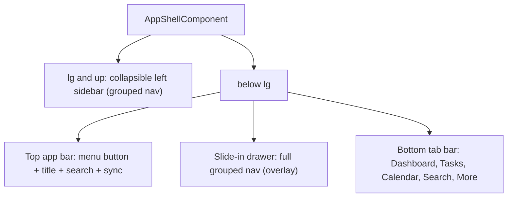

# Application Design — Responsive Shell + Design System + PWA (v1)

## 1. Navigation Architecture

### Breakpoints
- Mobile: `< 1024px` (below Tailwind `lg`) — top bar + drawer + bottom tab bar.
- Desktop: `>= 1024px` (`lg+`) — persistent, collapsible sidebar; no bottom bar.

### Navigation groups (drawer + sidebar)
- **Core**: Dashboard, Tasks, Calendar, Notifications
- **Health**: Habits, Running, Mood, Journal
- **Growth**: Goals, Learning, Career, Finance, Wishlist
- **Knowledge**: Communication, Q&A, Memory, Files, OCR, Voice
- **Insights**: Analytics, Reports, Timeline, Life Timeline, Predictions
- **System**: Coaches, Integrations, Automations, Export, Profile

### Bottom tab bar (mobile primary destinations)
Dashboard, Tasks, Calendar, Search, More (More opens the drawer).

## 2. Design System (styles.css)

Semantic CSS variables (mapped for light + dark), keeping legacy `--xp-*` names as aliases so
existing templates using `bg-[var(--xp-blue)]` etc. keep rendering with the modern palette.

- Color roles: `--surface`, `--surface-2`, `--surface-3`, `--border`, `--text`, `--text-muted`,
  `--primary`, `--primary-strong`, `--primary-contrast`, `--ring`.
- Legacy aliases: `--xp-blue → --primary`, `--xp-panel → --surface-2`, `--xp-silver → --surface-3`,
  `--xp-border → --border`, `--xp-text → --text`.
- Dark mode: `@media (prefers-color-scheme: dark)` defaults, overridable by `html.dark` /
  `html.light` classes set from a persisted user preference (`localStorage` key `lifeos-theme`).
- Utilities: `.safe-top`, `.safe-bottom`, `.safe-x` (env(safe-area-inset-*)), `min-h-dvh` usage.
- Components restyled but class names preserved: `.title-bar`, `.panel`, `.btn-primary`,
  `.input-field`; touch targets >= 44px on interactive controls.

## 3. Component / File Impact
- `shared/layout/app-shell.component.ts` — rewritten for responsive shell + theme + drawer state.
- `shared/layout/nav-items.ts` (new) — single source of grouped nav definitions.
- `core/services/theme.service.ts` (new) — light/dark preference with signal + persistence.
- `core/services/pwa.service.ts` (new) — install prompt + SwUpdate handling.
- `features/offline/offline-page.component.ts` (new) — offline fallback screen (`/offline`).
- `styles.css` — design tokens + dark mode + safe-area + component restyle.
- `features/dashboard/dashboard.component.ts`, `features/tasks/*` — responsive pattern pass.
- PWA config: `public/manifest.webmanifest`, `src/index.html`, `ngsw-config.json`, `public/icons/*`.

## 4. PWA Design
- **Icons**: `icon-192.png`, `icon-512.png`, `icon-maskable-512.png`, `apple-touch-icon.png` (180).
- **Manifest**: `id`, `icons[]`, `shortcuts[]` (Dashboard/Tasks/Search), `categories`,
  `display: standalone`, `orientation: portrait`, theme/background aligned to design tokens.
- **Service worker** (`ngsw-config.json`):
  - `navigationUrls`: exclude `/api/**`.
  - `dataGroups`: `api-freshness` (freshness, GET `/api/**`, short timeout, maxAge) and
    `api-performance` for rarely-changing lookups where appropriate.
- **Runtime services**: `PwaService` exposes `installAvailable` signal + `promptInstall()`, and
  `updateAvailable` signal + `applyUpdate()` from `SwUpdate.versionUpdates`.
- **Offline fallback**: `/offline` route; navigation errors while offline route here.

## 5. Accessibility
- Drawer: `role="dialog"`, `aria-modal`, focus management, `Esc` to close, backdrop click closes.
- Buttons: `aria-label` for icon-only controls; `aria-current="page"` via `routerLinkActive`.
- Visible focus ring using `--ring`.
